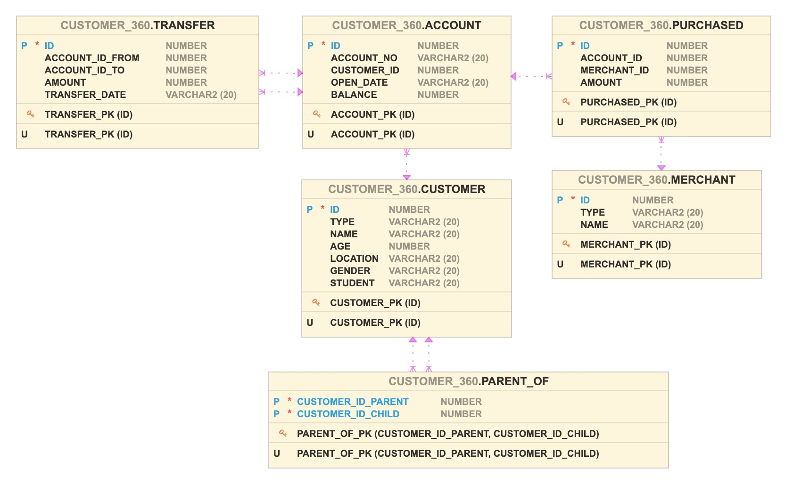
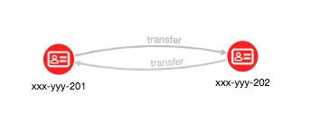
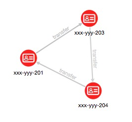
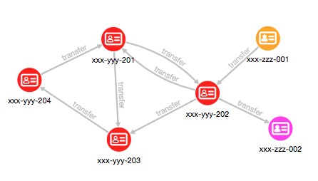

# Bank Customer 360 Degrees Analysis

## Introduction

This example shows how integrating multiple datasets, using a graph, facilitates additional analytics can lead to new insights. We will use three small datasets for illustrative purposes. The first contains accounts and account owners. The second is purchases by the people who own those accounts. The third is transactions between these accounts.

The combined dataset is then used to perform the following common graph query and analyses: pattern matching, detection of cycles, finding important nodes, community detection, and recommendation.

### Sections

* [Load Data into Database](#Load-Data-into-Database)
* [Create a Graph](#Create-a-Graph)
* [Run PGQL Queries](#Run-PGQL-Queries)
* [Pattern Matching](#Pattern-Matching)
* [Detection of Cycles](#Detection-of-Cycles)
* [Influential Accounts](#Influential-Accounts)
* [Community Detection](#Community-Detection)
* [Recommendation](#Recommendation)

## Load Data into Database

Create a database user.

    $ sqlplus sys/Welcome1@orclpdb1 as sysdba @create_user.sql

Create tables and insert data.

    $ sqlplus customer_360/Welcome1@orclpdb1 @create_tables.sql

The following ER diagram depicts the relationships between the datasets.



## Create a Graph

Connect to Graph Server using Graph Client.

`JShell`

    $ opg-jshell -b https://localhost:7007 --user customer_360
    enter password for user customer_360 (press Enter for no password): [Welcome1]
    ...
    opg-jshell>

`Python`

    $ opgpy --base_url https://localhost:7007 --user customer_360
    enter password for user customer_360 (press Enter for no password):
    ...
    >>>

The mapping between tables and a graph is defined in the statement below.

`create_pg.pgql`

```sql
CREATE PROPERTY GRAPH "customer_360"
  VERTEX TABLES (
    customer
  , account
  , merchant
  )
  EDGE TABLES (
    account
      SOURCE KEY(id) REFERENCES account
      DESTINATION KEY(customer_id) REFERENCES customer
      LABEL owned_by PROPERTIES (id)
  , parent_of
      SOURCE KEY(customer_id_parent) REFERENCES customer
      DESTINATION KEY(customer_id_child) REFERENCES customer
  , purchased
      SOURCE KEY(account_id) REFERENCES account
      DESTINATION KEY(merchant_id) REFERENCES merchant
  , transfer
      SOURCE KEY(account_id_from) REFERENCES account
      DESTINATION KEY(account_id_to) REFERENCES account
  )
```

Run this query, then the data from database is converted to a graph and extracted on memory.

`JShell`

```java
opg-jshell> var statement = Files.readString(Path.of("./customer_360/create_pg.pgql"))
opg-jshell> session.preparePgql(statement).execute()
```

`Python`

```py
>>> statement = open('./customer_360/create_pg.pgql', 'r').read()
>>> session.prepare_pgql(statement).execute()
```

Attach the graph.

`JShell`

```java
opg-jshell> var graph = session.getGraph("customer_360");
graph ==> PgxGraph[name=Customer 360,N=15,E=24,created=1603876687114]
```

`Python`

```py
>>> graph = session.get_graph("customer_360")
>>> graph
PgxGraph(name: customer_360, v: 15, e: 24, directed: True, memory(Mb): 0)
```

## Run PGQL Queries

Run an example query against the graph.

`JShell`

```java
opg-jshell> graph.queryPgql(
                " SELECT ID(e) "
              + " FROM MATCH ()-[e]->() "
              + " LIMIT 10 "
            ).print();
```

`Python`

```py
>>> graph2.query_pgql("""
        SELECT ID(e)
        FROM MATCH ()-[e]->()
        LIMIT 10
    """).print()
```

Alternatively, the query text can be loaded from files.

`JShell`

```java
opg-jshell> graph.queryPgql(Files.readString(Path.of("<name>.pgql"))).print();
```

`Python`

```py
>>> graph.query_pgql(open('<name>.pgql', 'r').read()).print()
```

## Pattern Matching

PGQL is convenient for detecting specific patterns.

Find accounts that had an inbound and an outbound transfer, of over 500, on the same day. The PGQL query for this is:

`01.pgql`

```sql
SELECT a.account_no
     , a.balance
     , t1.amount AS t1_amount
     , t2.amount AS t2_amount
     , t1.transfer_date
FROM MATCH (a)<-[t1:transfer]-(a1)
   , MATCH (a)-[t2:transfer]->(a2)
WHERE t1.transfer_date = t2.transfer_date
  AND t1.amount > 500
  AND t2.amount > 500
```

```py
>>> graph.query_pgql(open('01.pgql', 'r').read()).print()

+---------------------------------------------------------------+
| account_no  | balance | t1_amount | t2_amount | transfer_date |
+---------------------------------------------------------------+
| xxx-yyy-202 | 200.0   | 900.0     | 850.0     | 2018-10-06    |
+---------------------------------------------------------------+
```

## Detection of Cycles

Next we use PGQL to find a series of transfers that start and end at the same account such as A to B to A, or A to B to C to A.

The first query could be expressed as:

`02.pgql`

```sql
SELECT a1.account_no    AS a1_account
     , t1.transfer_date AS t1_date
     , t1.amount        AS t1_amount
     , a2.account_no    AS a2_account
     , t2.transfer_date AS t2_date
     , t2.amount        AS t2_amount
FROM MATCH (a1)-[t1:transfer]->(a2)-[t2:transfer]->(a1)
WHERE t1.transfer_date < t2.transfer_date
```

```py
>>> graph.query_pgql(open('02.pgql', 'r').read()).print()

+-----------------------------------------------------------------------------+
| a1_account  | t1_date    | t1_amount | a2_account  | t2_date    | t2_amount |
+-----------------------------------------------------------------------------+
| xxx-yyy-201 | 2018-10-05 | 200.0     | xxx-yyy-202 | 2018-10-10 | 300.0     |
+-----------------------------------------------------------------------------+
```



`03.pgql`

```sql
SELECT a1.account_no AS a1_account
     , t1.amount     AS t1_amount
     , a2.account_no AS a2_account
     , t2.amount     AS t2_amount
     , a3.account_no AS a3_account
     , t3.amount     AS t3_amount
FROM MATCH (a1)-[t1:transfer]->(a2)-[t2:transfer]->(a3)-[t3:transfer]->(a1)
WHERE t1.transfer_date < t2.transfer_date
  AND t2.transfer_date < t3.transfer_date
```

```py
>>> graph.query_pgql(open('03.pgql', 'r').read()).print()

+-----------------------------------------------------------------------------+
| a1_account  | t1_amount | a2_account  | t2_amount | a3_account  | t3_amount |
+-----------------------------------------------------------------------------+
| xxx-yyy-201 | 500.0     | xxx-yyy-203 | 450.0     | xxx-yyy-204 | 400.0     |
+-----------------------------------------------------------------------------+
```



## Influential Accounts

Let's find which accounts are influential in the network. There are various algorithms to score the importance and centrality of the vertices. We'll use the built-in PageRank algorithm as an example.

Filter customers from the graph. (cf. [Filter Expressions](https://docs.oracle.com/cd/E56133_01/latest/reference/filter.html))

```py
graph2 = graph.filter(pgx.EdgeFilter("edge.label()='TRANSFER'"))
graph2

PgxGraph(name: sub-graph_16, v: 6, e: 8, directed: True, memory(Mb): 0)
```

Run [PageRank Algorithm](https://docs.oracle.com/cd/E56133_01/latest/reference/analytics/algorithms/pagerank.html). PageRank Algorithm assigns a numeric weight to each vertex, measuring its relative importance within the graph.

```py
analyst.pagerank(graph2);

VertexProperty(name: pagerank, type: double, graph: sub-graph_16)
```

Show the result.

```py
graph2.query_pgql("""
    SELECT a.account_no, a.pagerank
    FROM MATCH (a)
    ORDER BY a.pagerank DESC
""").print()

+-------------------------------------+
| a.account_no | a.pagerank           |
+-------------------------------------+
| xxx-yyy-201  | 0.18012007557258927  |
| xxx-yyy-204  | 0.1412461615467829   |
| xxx-yyy-203  | 0.1365633635065475   |
| xxx-yyy-202  | 0.12293884324085073  |
| xxx-zzz-212  | 0.05987452026569676  |
| xxx-zzz-211  | 0.025000000000000005 |
+-------------------------------------+
```

## Community Detection

Let's find which subsets of accounts form communities. That is, there are more transfers among accounts in the same subset than there are between those and accounts in another subset. We'll use the built-in weekly / strongly connected components algorithm.

The first step is to create a subgraph that only has the accounts and the transfers among them. This is done by creating and applying an edge filter (for edges with the table "transfer') to the graph.

Filter customers from the graph.

```py
graph2 = graph.filter(pgx.EdgeFilter("edge.label()='TRANSFER'"))
graph2

PgxGraph(name: sub-graph_16, v: 6, e: 8, directed: True, memory(Mb): 0)
```

[Weakly connected component](https://docs.oracle.com/cd/E56133_01/latest/reference/algorithms/wcc.html) (WCC)algorithm detects only one partition.

```py
analyst.wcc(graph2)

PgxPartition(graph: sub-graph_16, components: 1)
```

The partition value is stored in a property named `WCC`.

```py
graph2.query_pgql("""
    SELECT a.wcc AS component_id
         , COUNT(*) AS count
    FROM MATCH (a)
    GROUP BY a.wcc
    ORDER BY a.wcc
""").print()

+----------------------+
| component_id | count |
+----------------------+
| 0            | 6     |
+----------------------+
```

In this case, all six accounts form one partition by the WCC algorithm.

Run a strongly connected components algorithm, SCC Kosaraju, instead.

[Strongly connected component](https://docs.oracle.com/cd/E56133_01/latest/reference/algorithms/scc.html) (SCC) algorithm detects three partitions.

```py
analyst.scc_kosaraju(graph2)

PgxPartition(graph: sub-graph_16, components: 3)
```

List partitions and number of vertices in each.

```py
graph2.query_pgql("""
    SELECT a.scc_kosaraju AS component_id
         , COUNT(*) AS count
    FROM MATCH (a)
    GROUP BY a.scc_kosaraju
    ORDER BY a.scc_kosaraju
""").print()

+----------------------+
| component_id | count |
+----------------------+
| 0            | 1     |
| 1            | 4     |
| 2            | 1     |
+----------------------+
```

List the other accounts in the same connected component (partition) as John's account.

The partition (or component) id is added as a property named `SCC_KOSARAJU` for use in PGQL queries.
*John's account_no is xxx-yyy-201 as shown in Lab 6.*

```py
graph2.query_pgql("""
    SELECT a.account_no
    FROM MATCH (a)
       , MATCH (a1)
    WHERE a1.account_no = 'xxx-yyy-201'
    AND a.scc_kosaraju = a1.scc_kosaraju
    ORDER BY a.account_no
""").print()

+-------------+
| account_no  |
+-------------+
| xxx-yyy-201 |
| xxx-yyy-202 |
| xxx-yyy-203 |
| xxx-yyy-204 |
+-------------+]
```



In this case, account `xxx-yyy-201` (John's account), `xxx-yyy-202`, `xxx-yyy-203`, and `xxx-yyy-204` form one partition, account `xxx-zzz-211` is a parition, and account `xxx-zzz-212` is a partition, by the SCC Kosaraju algorithm.

## Recommendation

Lastly let's use Personalized PageRank to find stores that John may purchase from given that people he is connected to have made purchases from those stores.

Filter customers and merchants from the graph.

    sg = g.filter(new EdgeFilter("edge.label()='purchased'"))

Add reverse edges.

    cs = sg.createChangeSet()
    rs = sg.queryPgql("SELECT a, x MATCH (a)-[:purchased]->(x)")
    for (r in rs) {
        a = r.getVertex(1).getId()
        x = r.getVertex(2).getId()
        cs.addEdge(x, a).setLabel("purchased_by")
    }
    sg = cs.build()
    sg.queryPgql("""
      SELECT ID(r), x.name, LABEL(r), a.account_no
      MATCH (x)-[r:purchased_by]->(a)
      LIMIT 3
    """).print()

    +---------------------------------------------------+
    | ID(r) | x.name      | LABEL(r)     | a.account_no |
    +---------------------------------------------------+
    | 11    | Apple Store | purchased_by | xxx-yyy-201  |
    | 13    | Apple Store | purchased_by | xxx-yyy-202  |
    | 16    | Apple Store | purchased_by | xxx-yyy-203  |
    +---------------------------------------------------+


We will focus on the account no. a01 (John's account) and run PPR.

    vertexSet = sg.createVertexSet()
    vertexSet.addAll("201")
    ppr = analyst.personalizedPagerank(sg, vertexSet)

Show the result. (cf. [EXISTS and NOT EXISTS subqueries](https://docs.oracle.com/cd/E56133_01/latest/reference/pgql-specification.html#exists-and-not-exists-subqueries))

    sg.queryPgql("""
      SELECT ID(x), x.name, x.pagerank
      MATCH (x)
      WHERE x.type = 'merchant'
        AND NOT EXISTS (
          SELECT *
          MATCH (x)-[:purchased_by]->(a)
          WHERE ID(a) = '201'
        )
      ORDER BY x.pagerank DESC
    """).print()

    +--------------------------------------------+
    | ID(x) | x.name       | x.pagerank          |
    +--------------------------------------------+
    | m03   | Kindle Store | 0.04932640133302745 |
    | m04   | Asia Books   | 0.04932640133302745 |
    | m05   | ABC Travel   | 0.01565535511504672 |
    +--------------------------------------------+

## Note

Partitioning is disabled, because:

- Filter method (used in analytics examples) is not supported for partitioned graphs

    "partition_while_loading":"by_label",