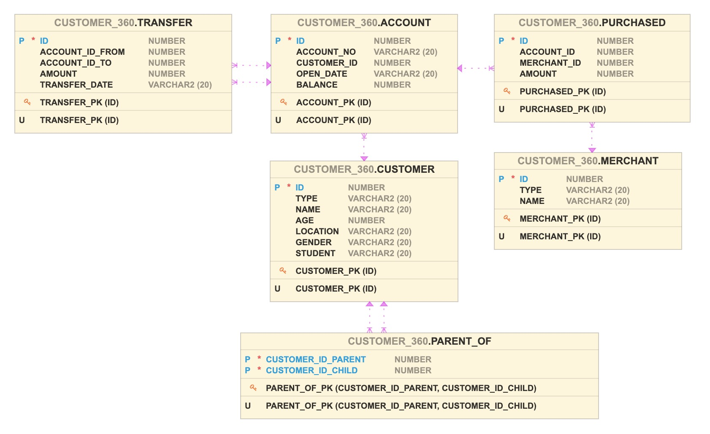
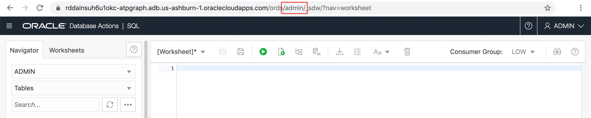

# Create and Populate Tables

## Introduction

In this lab, you are going to log in as user `CUSTOMER_360`. You will learn how to clear previous tables, create new tables, and populate the tables with your data.

You will create 7 tables (customer, account, merchant, purchased, transfer, parent_of). The entity-relationship diagram for these tables is shown below.



Estimated time: 7 minutes

### Objectives

- Learn how to connect to your new Autonomous Database using SQL Developer Web
- Learn how to create tables and insert data using SQL

### Prerequisites

- This lab assumes you have successfully completed the lab - Create and enable a user in SQL Developer Web.

## **STEP 1:** Log in to SQL Developer Web

Open the correct URL for SQL Developer Web for the `CUSTOMER_360` user. It is almost the same URL as the one for the Admin user execpt that `admin` in that url is replaced with the schema-alias we provided, i.e. with `customer_360`.



Login as `CUSTOMER_360` using the password you entered when creating the user.

*Note: Use the password you choose in Step 2 in Lab 4.*


### Troubleshooting

If you receive a *Service Unavailable* error, it may be that the `CUSTOMER_360` account is locked.


You can try the following steps:

1. Log in as `ADMIN`, enter and run the command in Worksheet:

    ```
    <copy>SELECT username, account_status FROM dba_users;</copy>
    ```

    In Query Result, check the account status of `CUSTOMER_360`. The status should be `OPEN`.

    

2. If the status is `LOCKED`, enter and run the command to unlock the user:

    ```
    <copy>ALTER USER customer_360 ACCOUNT UNLOCK;</copy>
    ```

3. Then, the status should change to `OPEN`. You can check again using command:

    ```
    <copy>SELECT username, account_status FROM dba_users;</copy>
    ```

## **STEP 2:** Drop existing tables if any

To ensure a clean slate, drop any existing tables. Copy, paste, and execute the following commands into the SQL Worksheet.

```
<copy>
DROP TABLE account;
DROP TABLE customer;
DROP TABLE merchant;
DROP TABLE parent_of;
DROP TABLE purchased;
DROP TABLE transfer;
</copy>
```


## **STEP 3:** Create and populate the `ACCOUNT` table

Clear the SQL Worksheet. Copy, paste, and run the following SQL script.

```
<copy>
CREATE TABLE account (
  id NUMBER NOT NULL
, account_no VARCHAR2(20)
, customer_id NUMBER
, open_date VARCHAR2(20)
, balance NUMBER
, CONSTRAINT account_pk PRIMARY KEY (id)
);

INSERT INTO account VALUES (201,'xxx-yyy-201',101,'2015-10-04',1500);
INSERT INTO account VALUES (202,'xxx-yyy-202',102,'2012-09-13',200);
INSERT INTO account VALUES (203,'xxx-yyy-203',103,'2016-02-04',2100);
INSERT INTO account VALUES (204,'xxx-yyy-204',104,'2018-01-05',100);
INSERT INTO account VALUES (211,'xxx-zzz-211',NULL,NULL,NULL);
INSERT INTO account VALUES (212,'xxx-zzz-212',NULL,NULL,NULL);
COMMIT;
</copy>
```


## **STEP 4:** Create and populate the `CUSTOMER` table

Clear the SQL Worksheet. Copy, paste, and run the following SQL script.

```
<copy>
CREATE TABLE customer (
  id NUMBER NOT NULL,
  name VARCHAR2(20),
  age NUMBER,
  location VARCHAR2(20),
  gender VARCHAR2(20),
  student VARCHAR2(20)
, CONSTRAINT customer_pk PRIMARY KEY (id)
);

INSERT INTO customer VALUES (101,'John',10,'Boston',NULL,NULL);
INSERT INTO customer VALUES (102,'Mary',NULL,NULL,'F',NULL);
INSERT INTO customer VALUES (103,'Jill',NULL,'Boston',NULL,NULL);
INSERT INTO customer VALUES (104,'Todd',NULL,NULL,NULL,'true');
COMMIT;
</copy>
```

## **STEP 5:** Create and populate the `MERCHANT` table

Clear the SQL Worksheet. Copy, paste, and run the following SQL script.

```
<copy>
CREATE TABLE merchant (
  id NUMBER NOT NULL
, name VARCHAR2(20)
, CONSTRAINT merchant_pk PRIMARY KEY (id)
);

INSERT INTO merchant VALUES (301,'Apple Store');
INSERT INTO merchant VALUES (302,'PC Paradise');
INSERT INTO merchant VALUES (303,'Kindle Store');
INSERT INTO merchant VALUES (304,'Asia Books');
INSERT INTO merchant VALUES (305,'ABC Travel');
COMMIT;
</copy>
```

## **STEP 7:** Create and populate the `PARENT_OF` table

Clear the SQL Worksheet. Copy, paste, and run the following SQL script.

```
<copy>
CREATE TABLE parent_of (
  customer_id_parent NUMBER
, customer_id_child NUMBER
, CONSTRAINT parent_of_pk PRIMARY KEY (customer_id_parent, customer_id_child)
);

INSERT INTO parent_of VALUES (103,104);
COMMIT;
</copy>
```

## **STEP 8:** Create and populate the `PURCHASED` table

Clear the SQL Worksheet. Copy, paste, and run the following SQL script.

```
<copy>
CREATE TABLE purchased (
  id NUMBER
, account_id NUMBER
, merchant_id NUMBER
, amount NUMBER
, CONSTRAINT purchased_pk PRIMARY KEY (id)
);

INSERT INTO purchased VALUES (1001,201,301,800);
INSERT INTO purchased VALUES (1002,201,302,15);
INSERT INTO purchased VALUES (1003,202,301,150);
INSERT INTO purchased VALUES (1004,202,302,20);
INSERT INTO purchased VALUES (1005,202,304,10);
INSERT INTO purchased VALUES (1006,203,301,350);
INSERT INTO purchased VALUES (1007,203,302,20);
INSERT INTO purchased VALUES (1008,203,303,15);
INSERT INTO purchased VALUES (1009,204,303,10);
INSERT INTO purchased VALUES (1010,204,304,15);
INSERT INTO purchased VALUES (1011,204,305,450);
COMMIT;
</copy>
```

## **STEP 9:** Create and populate the `TRANSFER` table

Clear the SQL Worksheet. Copy, paste, and run the following SQL script.

```
<copy>
CREATE TABLE transfer (
  id NUMBER
, account_id_from NUMBER
, account_id_to NUMBER
, amount NUMBER
, transfer_date VARCHAR2(20)
, CONSTRAINT transfer_pk PRIMARY KEY (id)
);

INSERT INTO transfer VALUES (100001,201,202,200,'2018-10-05');
INSERT INTO transfer VALUES (100002,211,202,900,'2018-10-06');
INSERT INTO transfer VALUES (100003,202,212,850,'2018-10-06');
INSERT INTO transfer VALUES (100004,201,203,500,'2018-10-07');
INSERT INTO transfer VALUES (100005,203,204,450,'2018-10-08');
INSERT INTO transfer VALUES (100006,204,201,400,'2018-10-09');
INSERT INTO transfer VALUES (100007,202,203,100,'2018-10-10');
INSERT INTO transfer VALUES (100008,202,201,300,'2018-10-10');
COMMIT;
</copy>
```

You may now proceed to the next lab.

## Acknowledgements

* **Author** - Jayant Sharma, Product Manager, Spatial and Graph
* **Contributors** - Thanks to Jenny Tsai and Arabella Yao for helpful, constructive feedback that improved this workshop.
* **Last Updated By/Date** - Ryota Yamanaka, Product Manager, Spatial and Graph, January 2021

