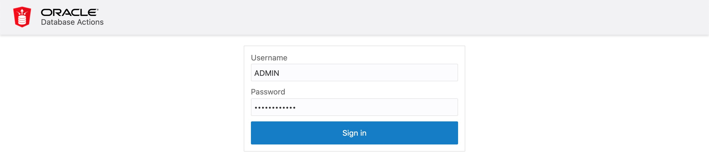

# Create and Enable a Database User in SQL Developer Web

## Introduction

This lab walks you through the steps to get started with SQL Developer Web. You will learn how to create a user in SQL Developer Web and provide that user the access to SQL Developer Web.

Estimated time: 3 minutes

### Objectives

- Learn how to setup the required database roles in SQL Developer Web.
- Learn how to create a database user in SQL Developer Web.

### Prerequisites

* Oracle cloud account
* Provisioned Autonomous Database Shared Instance

## **STEP 1:** Create database roles

1. Login as the Admin user in SQL Developer Web of the newly created ADB instance.

    Go to your Cloud Console, click **Autonomous Transaction Processing**. Select the ADB instance **ATP Graph** you created in Lab 2.

    

    In Autonomous Database Details page, click **Service Console**. Make sure your brower allow pop-up windows.

    

    Choose Development from the list on the left, then click the **SQL Developer Web**.

    

    Enter `ADMIN` as Username and go next.

    

    Input the password (you set up at Lab 2 Step 2, Section 7) and sign in.

    
  
    Logged in as the `ADMIN` user. 

    

2. Now create the roles required for the graph feature. Enter the following commands into the SQL Worksheet and run it while connected as the Admin user.

    Create the roles required by the graph server.
    ```
    <copy>
    DECLARE
      PRAGMA AUTONOMOUS_TRANSACTION;
      role_exists EXCEPTION;
      PRAGMA EXCEPTION_INIT(role_exists, -01921);
      TYPE graph_roles_table IS TABLE OF VARCHAR2(50);
      graph_roles graph_roles_table;
    BEGIN
      graph_roles := graph_roles_table(
        'GRAPH_DEVELOPER',
        'GRAPH_ADMINISTRATOR',
        'PGX_SESSION_CREATE',
        'PGX_SERVER_GET_INFO',
        'PGX_SERVER_MANAGE',
        'PGX_SESSION_READ_MODEL',
        'PGX_SESSION_MODIFY_MODEL',
        'PGX_SESSION_NEW_GRAPH',
        'PGX_SESSION_GET_PUBLISHED_GRAPH',
        'PGX_SESSION_COMPILE_ALGORITHM',
        'PGX_SESSION_ADD_PUBLISHED_GRAPH');
      FOR elem IN 1 .. graph_roles.count LOOP
      BEGIN
        dbms_output.put_line('create_graph_roles: ' || elem || ': CREATE ROLE ' || graph_roles(elem));
        EXECUTE IMMEDIATE 'CREATE ROLE ' || graph_roles(elem);
      EXCEPTION
        WHEN role_exists THEN
          dbms_output.put_line('create_graph_roles: role already exists. continue');
        WHEN OTHERS THEN
          RAISE;
        END;
      END LOOP;
    EXCEPTION
      when others then
        dbms_output.put_line('create_graph_roles: hit error ');
        raise;
    END;
    /
    </copy>
    ```

    Assign the default permissions to the roles, `GRAPH_DEVELOPER` and `GRAPH_ADMINISTRATOR`, to group multiple permissions together.
    ```
    <copy>
    GRANT PGX_SESSION_CREATE TO GRAPH_ADMINISTRATOR;
    GRANT PGX_SERVER_GET_INFO TO GRAPH_ADMINISTRATOR;
    GRANT PGX_SERVER_MANAGE TO GRAPH_ADMINISTRATOR;
    GRANT PGX_SESSION_CREATE TO GRAPH_DEVELOPER;
    GRANT PGX_SESSION_NEW_GRAPH TO GRAPH_DEVELOPER;
    GRANT PGX_SESSION_GET_PUBLISHED_GRAPH TO GRAPH_DEVELOPER;
    GRANT PGX_SESSION_MODIFY_MODEL TO GRAPH_DEVELOPER;
    GRANT PGX_SESSION_READ_MODEL TO GRAPH_DEVELOPER;
    </copy>
    ```

## **STEP 2:** Create a database user

Now create the `CUSTOMER_360` user. Enter the following commands into the SQL Worksheet and run it while connected as the Admin user.

Note: Replace **<specify_a_password>** with a valid password string after copying and pasting the text below but **before executing** it in SQL Developer Web.

```
<copy>
CREATE USER customer_360 
IDENTIFIED BY <specify_a_password> 
DEFAULT TABLESPACE data 
TEMPORARY TABLESPACE temp 
QUOTA UNLIMITED ON data;

GRANT create session, create table, create view TO customer_360;
-- The following additional privileges are necessary for two-tier architecture (= PGQL-on-RDBMS)
-- GRANT ALTER SESSION, CREATE PROCEDURE, CREATE TYPE, CREATE SEQUENCE, CREATE TRIGGER TO customer_360;

GRANT graph_developer TO customer_360;
</copy>
```


*Notes:* 
- *The `IDENTIFIED BY` clause specifies the password (i.e whatever you replaced <specify_a_password> with)*
- *The Graph Server uses database authentication ([details](https://docs.oracle.com/en/database/oracle/oracle-database/20/spgdg/using-inmemory-analyst-oracle-database.html)). The user needs at least the graph_developer role.*

## **STEP 3:** Enable SQL Developer Web for the new user

Now provide SQL Developer Web access for this user. See the [documentation](https://docs.oracle.com/en/cloud/paas/autonomous-data-warehouse-cloud/user/sql-developer-web.html#GUID-4B404CE3-C832-4089-B37A-ADE1036C7EEA) for details.

Open the main menu and click "Database Users".


Open the menu for the user and click "Enable REST".


Click "REST Enable User" to apply the change.


The URL for SQL Developer Web for the `CUSTOMER_360` user will have `customer_360` in place of `admin` in it. Save the URL for the next step.


For details, see the ["Provide SQL Developer Web Access to Database Users"](https://docs.oracle.com/en/cloud/paas/autonomous-data-warehouse-cloud/user/sql-developer-web.html#GUID-4B404CE3-C832-4089-B37A-ADE1036C7EEA) section in the documentation.

You may now proceed to the next lab.

## Acknowledgements ##

* **Author** - Jayant Sharma, Product Manager, Spatial and Graph.
* **Contributors** - Thanks to Jenny Tsai for helpful, constructive feedback that improved this workshop. Arabella Yao, Product Manager Intern, Database Management.
* **Last Updated By/Date** - Ryota Yamanaka, Feburary 2021

