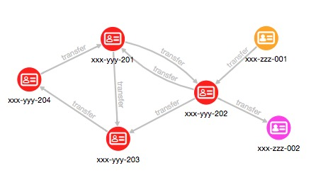

# Query and Analyze the Graphs

## Introduction

This example shows how integrating multiple datasets and using a graph facilitate additional analytics and can lead to new insights. We will use three small datasets for illustrative purposes. The first contains accounts and account  owners. The second is purchases by the people who own those accounts. The third is transactions between these accounts.

The combined dataset is then used to perform the following common graph query and analyses: pattern matching, detection of cycles, finding important nodes, community detection, and recommendation.

The following ER diagram depicts the relationships between the datasets.


Estimated Lab Time: 10 minutes

### Objectives

- Learn how to query and analyze the Customer 360 graph with the Graph Server and Client kit.

### Prerequisites

- This lab assumes you have successfully completed all the previous Labs (Lab 1 through Lab 6) and have the Python client up and running.

## **STEP 1:** Get the Graph on Memory

Assuming that the `customer_360` graph is already loaded onto the memory in the previous Lab, the graph can be attached with this command. If the graph is published, you can also access the graph from the new sessions.

```
<copy>
graph = session.get_graph("customer_360")
</copy>
```

Now we can query this graph and run some analyses on it.

## **STEP 2:** Pattern Matching

PGQL Query is convenient for detecting specific patterns.

Find accounts that had an inbound and an outbound transfer, of over 500, on the same day. The PGQL query for this is:

```
<copy>
graph.query_pgql("""
    SELECT a.account_no
         , a.balance
         , t1.amount AS t1_amount
         , t2.amount AS t2_amount
         , t1.transfer_date
    FROM MATCH (a)<-[t1:transfer]-(a1)
       , MATCH (a)-[t2:transfer]->(a2)
    WHERE t1.transfer_date = t2.transfer_date
      AND t1.amount > 500
      AND t2.amount > 500
""").print()
</copy>

+---------------------------------------------------------------+
| account_no  | balance | t1_amount | t2_amount | transfer_date |
+---------------------------------------------------------------+
| xxx-yyy-202 | 200.0   | 900.0     | 850.0     | 2018-10-06    |
+---------------------------------------------------------------+
```

## **STEP 3:** Detection of Cycles

Next we use PGQL to find a series of transfers that start and end at the same account, such as A to B to A, or A to B to C to A.

The first query could be expressed as:

```
<copy>
graph.query_pgql("""
    SELECT a1.account_no    AS a1_account
         , t1.transfer_date AS t1_date
         , t1.amount        AS t1_amount
         , a2.account_no    AS a2_account
         , t2.transfer_date AS t2_date
         , t2.amount        AS t2_amount
    FROM MATCH (a1)-[t1:transfer]->(a2)-[t2:transfer]->(a1)
    WHERE t1.transfer_date < t2.transfer_date
""").print()
</copy>

+-----------------------------------------------------------------------------+
| a1_account  | t1_date    | t1_amount | a2_account  | t2_date    | t2_amount |
+-----------------------------------------------------------------------------+
| xxx-yyy-201 | 2018-10-05 | 200.0     | xxx-yyy-202 | 2018-10-10 | 300.0     |
+-----------------------------------------------------------------------------+
```


The second query just adds one more transfer to the pattern (list) and could be expressed as:

```
<copy>
graph.query_pgql("""
    SELECT a1.account_no AS a1_account
         , t1.amount     AS t1_amount
         , a2.account_no AS a2_account
         , t2.amount     AS t2_amount
         , a3.account_no AS a3_account
         , t3.amount     AS t3_amount
    FROM MATCH (a1)-[t1:transfer]->(a2)-[t2:transfer]->(a3)-[t3:transfer]->(a1)
    WHERE t1.transfer_date < t2.transfer_date
      AND t2.transfer_date < t3.transfer_date
""").print()
</copy>

+-----------------------------------------------------------------------------+
| a1_account  | t1_amount | a2_account  | t2_amount | a3_account  | t3_amount |
+-----------------------------------------------------------------------------+
| xxx-yyy-201 | 500.0     | xxx-yyy-203 | 450.0     | xxx-yyy-204 | 400.0     |
+-----------------------------------------------------------------------------+
```


## **STEP 4:** Influential Accounts

1. Filter customers from the graph. (cf. [Filter Expressions](https://docs.oracle.com/cd/E56133_01/latest/prog-guides/filter.html))

    ```
    <copy>
    graph2 = graph.filter(pgx.EdgeFilter("edge.label()='TRANSFER'"))
    graph2
    </copy>

    PgxGraph(name: sub-graph_16, v: 6, e: 8, directed: True, memory(Mb): 0)
    ```

2. Run [PageRank Algorithm](https://docs.oracle.com/cd/E56133_01/latest/reference/analytics/algorithms/pagerank.html). PageRank Algorithm assigns a numeric weight to each vertex, measuring its relative importance within the graph.

    ```
    <copy>
    analyst.pagerank(graph2)
    </copy>

    VertexProperty(name: pagerank, type: double, graph: sub-graph_16)
    ```

3. Show the result.

    ```
    <copy>
    graph2.query_pgql("""
        SELECT a.account_no, a.pagerank
        FROM MATCH (a)
        ORDER BY a.pagerank DESC
    """).print()
    </copy>

    +-------------------------------------+
    | a.account_no | a.pagerank           |
    +-------------------------------------+
    | xxx-yyy-201  | 0.18012007557258927  |
    | xxx-yyy-204  | 0.1412461615467829   |
    | xxx-yyy-203  | 0.1365633635065475   |
    | xxx-yyy-202  | 0.12293884324085073  |
    | xxx-zzz-212  | 0.05987452026569676  |
    | xxx-zzz-211  | 0.025000000000000005 |
    +-------------------------------------+
    ```

## **STEP 5:** Community Detection

Let's find which subsets of accounts form communities. That is, there are more transfers among accounts in the same subset than there are between those and accounts in another subset. We'll use the built-in weakly / strongly connected components algorithm.

1. The first step is to create a subgraph that only has the accounts and the transfers among them. This is done by creating and applying an edge filter (for edges with the lable "transfer') to the graph.

    Filter customers from the graph.

    ```
    <copy>
    graph2 = graph.filter(pgx.EdgeFilter("edge.label()='TRANSFER'"))
    graph2
    </copy>

    PgxGraph(name: sub-graph_16, v: 6, e: 8, directed: True, memory(Mb): 0)
    ```

2. [Weakly Connected Component](https://docs.oracle.com/cd/E56133_01/latest/reference/analytics/algorithms/wcc.html) (WCC) algorithm detects only one partition.

    ```
    <copy>
    analyst.wcc(graph2)
    </copy>

    PgxPartition(graph: sub-graph_16, components: 1)
    ```

    The partition value is stored in a property named `WCC`.

    ```
    <copy>
    graph2.query_pgql("""
        SELECT a.wcc AS component_id
             , COUNT(*) AS count
        FROM MATCH (a)
        GROUP BY a.wcc
        ORDER BY a.wcc
    """).print()
    </copy>

    +----------------------+
    | component_id | count |
    +----------------------+
    | 0            | 6     |
    +----------------------+
    ```

    In this case, all six accounts form one partition by the WCC algorithm.

3. Run a strongly connected components algorithm, SCC Kosaraju, instead.

    [Strongly Connected Component](https://docs.oracle.com/cd/E56133_01/latest/reference//analytics/algorithms/scc.html) (SCC) algorithm detects three partitions.

    ```
    <copy>
    analyst.scc_kosaraju(graph2)
    </copy>

    PgxPartition(graph: sub-graph_16, components: 3)
    ```

4. List partitions and number of vertices in each.

    ```
    <copy>
    graph2.query_pgql("""
        SELECT a.scc_kosaraju AS component_id
             , COUNT(*) AS count
        FROM MATCH (a)
        GROUP BY a.scc_kosaraju
        ORDER BY a.scc_kosaraju
    """).print()
    </copy>

    +----------------------+
    | component_id | count |
    +----------------------+
    | 0            | 1     |
    | 1            | 4     |
    | 2            | 1     |
    +----------------------+
    ```

5. List the other accounts in the same conneted component (partition) as John's account.

    The partition (or component) id is added as a property named `SCC_KOSARAJU` for use in PGQL queries.
    *John's account_no is xxx-yyy-201 as shown in Lab 6.*

    ```
    <copy>
    graph2.query_pgql("""
        SELECT a.account_no
        FROM MATCH (a)
           , MATCH (a1)
        WHERE a1.account_no = 'xxx-yyy-201'
        AND a.scc_kosaraju = a1.scc_kosaraju
        ORDER BY a.account_no
    """).print()
    </copy>

    +-------------+
    | account_no  |
    +-------------+
    | xxx-yyy-201 |
    | xxx-yyy-202 |
    | xxx-yyy-203 |
    | xxx-yyy-204 |
    +-------------+]
    ```

    

    In this case, account `xxx-yyy-201` (John's account), `xxx-yyy-202`, `xxx-yyy-203`, and `xxx-yyy-204` form one partition, account `xxx-zzz-211` is a parition, and account `xxx-zzz-212` is a partition, by the SCC Kosaraju algorithm.

You may now proceed to the next Lab.

## Acknowledgements ##

* **Author** -  Jayant Sharma, Product Manager, Spatial and Graph
* **Contributors** - Arabella Yao, Product Manager Intern, Database Management, and Jenny Tsai.
* **Last Updated By/Date** - Ryota Yamanaka, Febrary 2021

